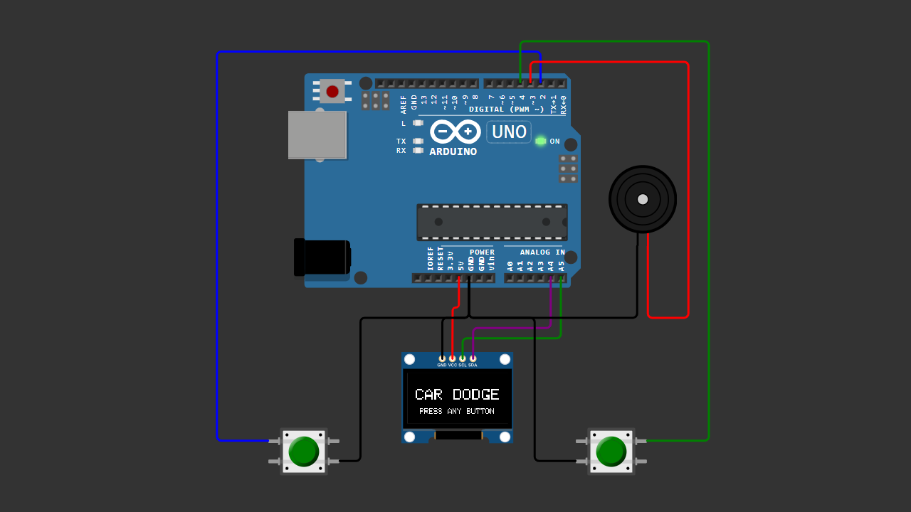

# Arduino OLED Car Dodging Game (3-Lane Arcade)

A beginner-friendly Arduino arcade game using a 0.96" SSD1306 OLED display.

Control your car across 3 lanes and avoid incoming enemies while the difficulty increases smoothly over time.

---

## 📌 Project Overview

This project is a simple yet fun **arcade-style car dodging game** built with Arduino.

The player moves left and right across **3 fixed lanes**, avoiding enemy cars that spawn from the top.

As the score increases:
- Enemy speed gradually increases  
- More enemies appear on screen  

The game includes a complete flow:
- Start Screen  
- Gameplay  
- Game Over Screen  

All controls are handled using **2 buttons**, and sound feedback is provided using a **buzzer**.

---

## 🧰 Components Required

- Arduino Uno / Nano  
- OLED Display 0.96" (SSD1306, I2C)  
- 2x Push Button  
- Buzzer  
- Jumper Wires  
- Breadboard (optional)  

---

## 🔌 Wiring Connections

| Component | Arduino |
|----------|--------|
| OLED VCC | 5V |
| OLED GND | GND |
| OLED SDA | A4 |
| OLED SCL | A5 |
| Button LEFT | Pin 2 → GND |
| Button RIGHT | Pin 4 → GND |
| Buzzer + | Pin 3 |
| Buzzer - | GND |

> Buttons use `INPUT_PULLUP`, so no external resistor is required.

---

## 📷 Wiring Diagram

> Make sure your wiring matches the diagram before uploading the code.

---

## 💻 Arduino Code

Download the full Arduino sketch here:

[Download Code](car_dodge_final_v6.ino)

Or open the `.ino` file directly inside this repository.

---

## 🚀 Getting Started

1. Connect all components according to the wiring table  
2. Install required libraries:
   - Adafruit GFX  
   - Adafruit SSD1306  
3. Upload the code to your Arduino  
4. Power the device  
5. Press any button to start the game  

---

## 🎮 Controls

- LEFT Button → Move Left  
- RIGHT Button → Move Right  
- Any Button → Start / Restart  

---

## 🔥 Features

- 3-lane gameplay system (clean & fair)
- Smooth difficulty scaling
- Multi-enemy system
- Moving road animation
- Sound effects (move, score, crash, game over)
- Minimalist arcade design
- Optimized for Arduino UNO

---

## 🧠 Learning Concepts

This project helps you understand:

- Game state management (Start / Play / Game Over)
- Basic game loop structure
- Collision detection
- OLED graphics rendering
- Button input handling
- Simple sound generation with buzzer
- Difficulty scaling logic

---

## 🎥 Video Tutorial

Watch the full tutorial on YouTube:

In this video, you will see:
- Full wiring setup  
- Code explanation  
- Gameplay demo  
- Tips for customization  

---

## 🚀 Future Improvements

- Pixel-art car sprites  
- Explosion animation  
- High score saving (EEPROM)  
- Background music  
- Power-up system  

---

## 📄 License

This project is open-source and free to use for educational purposes.

---

Happy Coding 🚀
